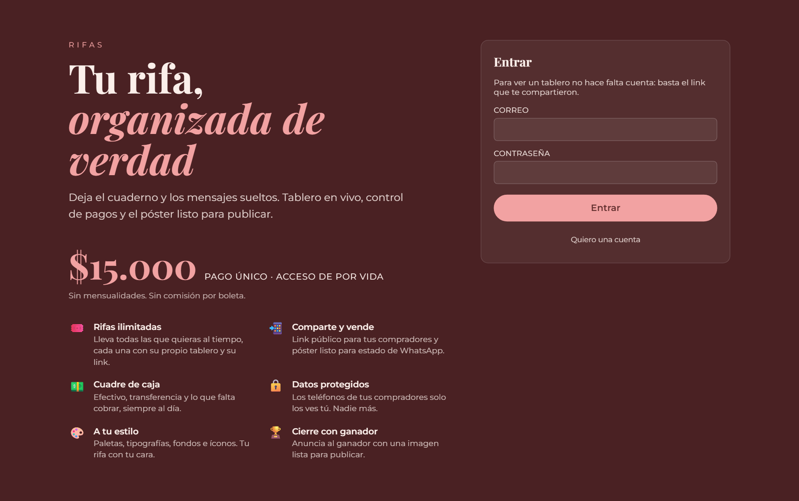
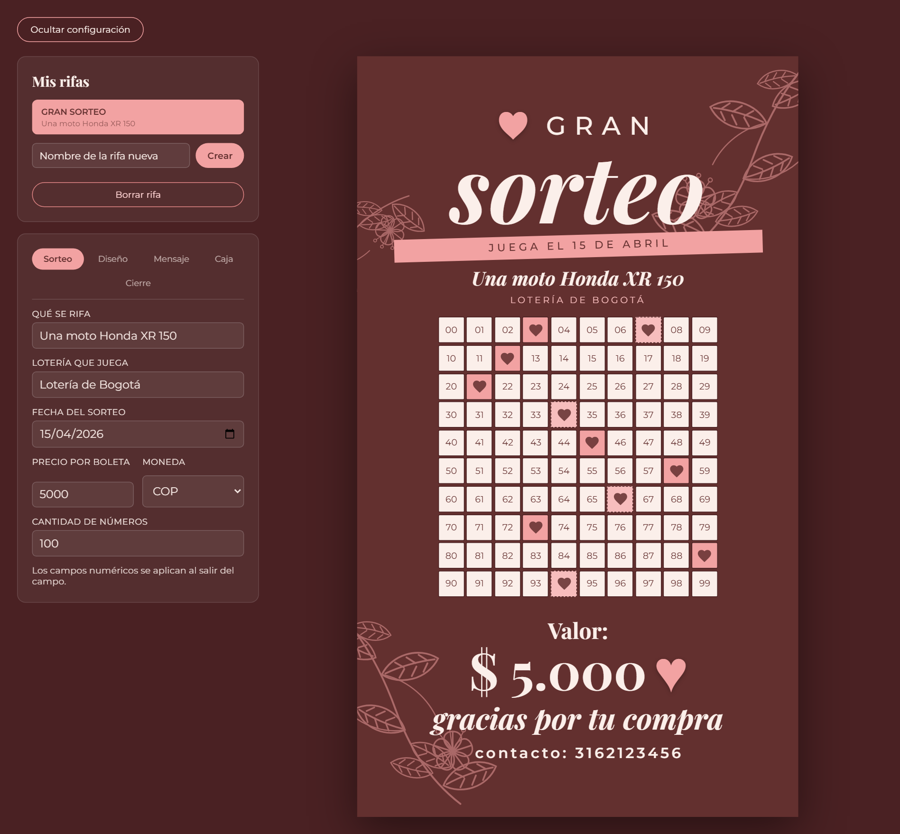
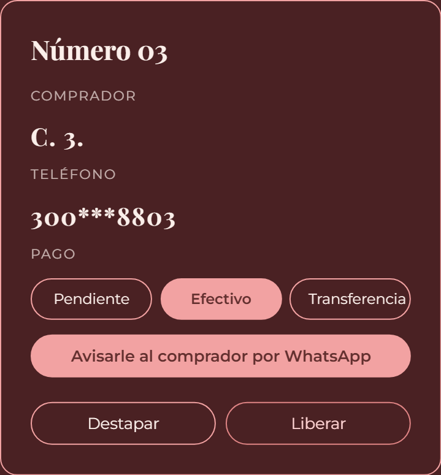
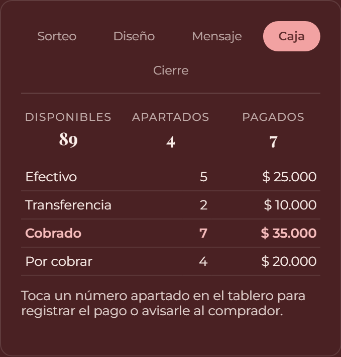
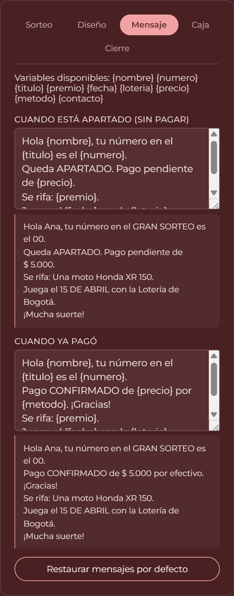
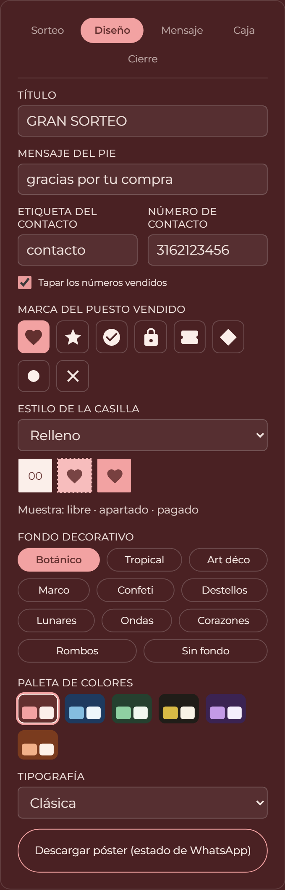
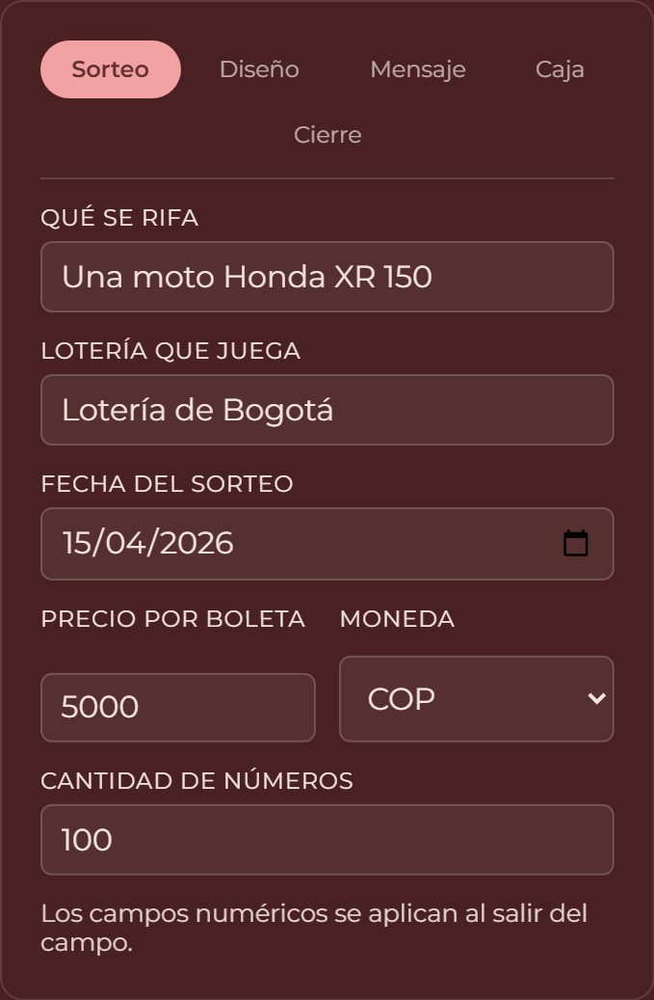

# Rifas

Plataforma para organizar rifas: tablero en vivo, control de pagos, póster listo
para publicar y anuncio del ganador. React + Vite + TypeScript, con Supabase de
base de datos y Brevo para los correos.



---

## Qué hace

### Tablero de la rifa

Cada rifa es un tablero de 00 a 99 (o el tamaño que definas). El organizador
vende, cobra y libera puestos; cualquiera con el link ve el estado en vivo.



| Estado | En el tablero |
|---|---|
| Libre | casilla lisa, con su número |
| Apartado (vendido, sin pagar) | tono claro, borde punteado, marca tenue |
| Pagado (efectivo o transferencia) | tono fuerte, marca marcada |
| Ganador | dorado con ★ |

### Control de cada puesto

Al tocar un número vendido: registrar el pago, avisarle al comprador por WhatsApp
con un mensaje ya armado, destapar sus datos o liberar el número.



Los datos del comprador salen tapados (`L. D. P.` / `316***3456`) hasta que el
dueño pulsa **Destapar**. No es maquillaje: a un visitante la API ni siquiera se
los manda.

### Cuadre de caja

Cuánto entró en efectivo, cuánto por transferencia y cuánto falta cobrar.



### Mensajes de WhatsApp

Plantillas editables con vista previa en vivo. Variables disponibles:
`{nombre} {numero} {titulo} {premio} {fecha} {loteria} {precio} {metodo} {contacto}`.



### Diseño

6 paletas, 4 tipografías, 11 fondos decorativos, 8 marcas para el puesto vendido
y 4 estilos de casilla. Todo monocromático: los íconos heredan el color de la
paleta y nunca chocan con ella.



### Datos del sorteo



### Cierre y anuncio del ganador

Al finalizar se genera una lámina aparte, lista para publicar.


### Póster exportable

El póster sale en PNG de 1080×1920, listo para estado de WhatsApp.


---

## Cuentas y roles

| Rol | Puede |
|---|---|
| `superadmin` | Aprobar o rechazar cuentas y ver el control general de todas las rifas |
| `admin` | Crear y llevar sus propias rifas |
| `cliente` | Declarado para más adelante; todavía sin permisos propios |

El registro no es automático: quien pide una cuenta queda **pendiente** hasta que
un superadmin la aprueba. La lista blanca `accesos_previos` deja entrar aprobado
y con rol asignado a los correos que estén ahí.

### Correos (Brevo)

| Momento | A quién |
|---|---|
| Alguien pide una cuenta | Al solicitante ("en revisión") y al superadmin ("nueva solicitud") |
| El superadmin aprueba | Al usuario ("tu cuenta está activa") |
| El superadmin rechaza | Al usuario |

El endpoint `POST /api/correo` exige el token de sesión de Supabase, el correo de
"solicitud" solo puede ir al propio usuario, y los de aprobación/rechazo solo los
puede disparar un superadmin. La API key vive **solo en el servidor**.

---

## Quién ve qué

| | Visitante con el link | Dueño de la rifa | Otra cuenta |
|---|---|---|---|
| Ver el tablero y qué está vendido | sí | sí | sí |
| Ver nombre y teléfono del comprador | **no** | sí, con "Destapar" | **no** |
| Vender, cobrar, liberar, configurar | no | sí | **no** |

Las políticas de Postgres son las que mandan, no la interfaz: escribir exige
`es_mia(rifa_id)` y `esta_aprobado()`, así que una cuenta no puede tocar las rifas
de otra ni con llamadas directas a la API.

---

## Poner en marcha

```bash
npm install
npm run dev
```

Sin variables de entorno la app corre en **modo local**: las rifas viven en
`localStorage`, sin cuentas ni aprobación. Sirve para probar.

### Base de datos (Supabase)

1. Crear el proyecto en [supabase.com](https://supabase.com).
2. Aplicar las migraciones:

```bash
npx supabase db push --db-url "postgresql://postgres.<REF>:<PASSWORD>@aws-0-<REGION>.pooler.supabase.com:5432/postgres" --yes
```

   O pegar `supabase.sql` y los archivos de `supabase/migrations/` en el **SQL Editor**.

3. En **Authentication → Providers → Email**, desactivar *Confirm email*: la
   confirmación la maneja el flujo de aprobación, no el correo de Supabase.

### Variables de entorno

Copiar `.env.example` a `.env`. El prefijo manda:

| Variable | Dónde vive | Para qué |
|---|---|---|
| `VITE_SUPABASE_URL` | navegador | Proyecto de Supabase |
| `VITE_SUPABASE_ANON_KEY` | navegador | Llave publicable |
| `BREVO_API_KEY` | **solo servidor** | Enviar correos |
| `BREVO_REMITENTE` | solo servidor | Remitente verificado en Brevo |
| `SUPERADMIN_EMAIL` | solo servidor | A quién avisar de solicitudes nuevas |
| `SUPABASE_URL` / `SUPABASE_ANON_KEY` | solo servidor | Validar la sesión en `/api/correo` |

> Vite expone al navegador **todo** lo que empiece por `VITE_`. La llave de Brevo
> no lleva ese prefijo a propósito: con él acabaría dentro del bundle público.
> Y solo ignora lo demás — un `NEXT_PUBLIC_*` no lo lee nadie.

Brevo entrega únicamente desde un **remitente verificado** (Brevo → Senders). Con
un dominio sin verificar la API responde 201 pero el correo se pierde o cae en spam.

### Desplegar en Vercel

```bash
npx vercel
```

`vercel.json` ya trae el framework, la carpeta `dist` y el rewrite de SPA. En
**Settings → Environment Variables** hay que cargar las seis variables de arriba.
Las funciones de `api/` se despliegan solas.

---

## Comprobaciones

```bash
npm test
```

16 pruebas sobre la lógica pura: rango 00–99, validaciones de venta, cuadre de
caja, plantillas de mensaje y cierre del sorteo.

```bash
node verificar-nube.mjs
```

Comprueba contra el proyecto real que existan las tablas, que `compradores` **no**
sea legible sin sesión y que un anónimo **no** pueda crear rifas.

---

## Estructura

| Archivo | Rol |
|---|---|
| `src/rifa.ts` | Tipos, reglas y validación. Sin React. Es lo que cubren las pruebas |
| `src/useRifa.ts` | Estado + Supabase (o `localStorage`) + realtime + sesión |
| `src/usePerfil.ts` | Rol, estado de la cuenta y solicitudes por revisar |
| `src/fondos.tsx` | Los 11 fondos decorativos |
| `src/temas.ts` | Paletas y tipografías |
| `src/marcas.tsx` | Íconos y estilos de casilla |
| `api/_correo.ts` | Plantillas y envío por Brevo (servidor) |
| `supabase/migrations/` | Esquema, roles, RLS y vista de control |
